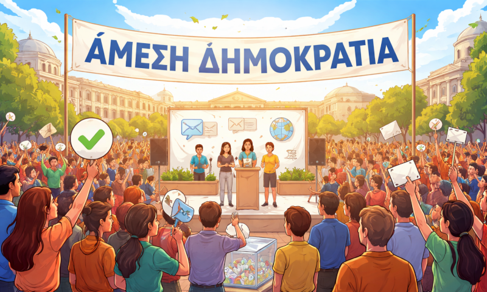
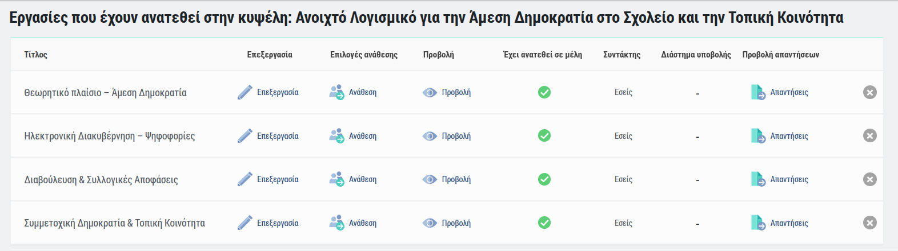

# Ανοιχτό Λογισμικό για την Άμεση Δημοκρατία στο Σχολείο και την Τοπική Κοινότητα

**8ος Πανελλήνιος Διαγωνισμός Ανοιχτών Τεχνολογιών στην Εκπαίδευση**  
**1ο ΕΠΑ.Λ. Καβάλας** – Γ΄ τάξη  
*Υπεύθυνος εκπαιδευτικός: Ιωάννης Δαγκουλής*  
*Περίοδος υλοποίησης: Ιανουάριος – Μάιος 2026*

---

## Σύνοψη

Στο πλαίσιο του μαθήματος «Σχεδιασμός και Ανάπτυξη Διαδικτυακών Εφαρμογών», η μαθητική μας ομάδα μελέτησε, αξιολόγησε και εφάρμοσε πιλοτικά ανοιχτό λογισμικό (ΕΛ/ΛΑΚ) για την υποστήριξη της συμμετοχικής δημοκρατίας. Στόχος ήταν να διερευνηθεί πώς εργαλεία όπως τα **Loomio** και **Decidim** μπορούν να αξιοποιηθούν στο σχολείο και την τοπική κοινότητα.

Το έργο συνδύασε **θεωρητική μελέτη** (έννοιες άμεσης δημοκρατίας, διεθνή παραδείγματα), **επίσκεψη πεδίου** (Δημαρχείο Καβάλας) και **πιλοτική εφαρμογή** ψηφιακών εργαλείων (Loomio, ZEUS, e-me).

---

## Θεωρητικό πλαίσιο – Τι είναι η Άμεση Δημοκρατία

### Ορισμός

**Άμεση δημοκρατία** (ή συμμετοχική δημοκρατία) είναι το πολίτευμα στο οποίο οι πολίτες αποφασίζουν απευθείας για τους νόμους και τις πολιτικές, χωρίς ενδιάμεσους εκπροσώπους. Αντίθετα, στην **αντιπροσωπευτική δημοκρατία** οι πολίτες εκλέγουν αντιπροσώπους που αποφασίζουν για λογαριασμό τους.

### Ιστορικές μορφές

- **Αρχαία Αθήνα (5ος-4ος αι. π.Χ.):** Η «Εκκλησία του Δήμου» συνεδρίαζε τακτικά. Όλοι οι ελεύθεροι άνδρες πολίτες μπορούσαν να μιλήσουν, να προτείνουν νόμους και να ψηφίσουν.
- **Νεότερη Ελβετία:** Από τον 19ο αιώνα, η Ελβετία συνδυάζει αντιπροσωπευτική δημοκρατία με ισχυρούς μηχανισμούς άμεσης συμμετοχής (δημοψηφίσματα, λαϊκές πρωτοβουλίες).

### Πλεονεκτήματα & Μειονεκτήματα

| Πλεονεκτήματα | Μειονεκτήματα/Προκλήσεις |
| :--- | :--- |
| Νομιμοποίηση αποφάσεων | Απαιτείται χρόνος και γνώση από τους πολίτες |
| Ενεργή πολιτική παιδεία | Κίνδυνος συναισθηματισμού και προπαγάνδας |
| Έλεγχος εξουσίας – μείωση διαφθοράς | Ανάγκη προστασίας μειοψηφιών |

### Η ψηφιακή διάσταση

Η τεχνολογία μπορεί να μειώσει το πρόβλημα του «χρόνου & γνώσης» μέσω:
- **Ασύγχρονης συμμετοχής** (κινητό, υπολογιστής)
- **Κλιμάκωσης** (εκατοντάδες χιλιάδες πολίτες ταυτόχρονα)
- **Διαφάνειας** (ελέγξιμος κώδικας ανοιχτού λογισμικού)

### Η θέση της ομάδας μας

> *Δεν προτείνουμε την κατάργηση της αντιπροσωπευτικής δημοκρατίας. Αυτό που επιδιώκουμε είναι να **πειραματιστούμε** με ψηφιακά εργαλεία άμεσης συμμετοχής, ώστε να καλύψουμε την ανάγκη για μεγαλύτερη συμμετοχή των πολιτών – και ειδικά των νέων – στις αποφάσεις που τους αφορούν.*

---

## Εκπαιδευτικοί Στόχοι – Παιδαγωγικά αποτελέσματα

### Σκοπός 1: Κατανόηση του θεωρητικού πλαισίου

**Τι κάναμε:** Οι μαθητές χωρίστηκαν σε 4 ομάδες και εργάστηκαν στην πλατφόρμα e-me μελετώντας την άμεση δημοκρατία, τις διαφορές από την αντιπροσωπευτική και διεθνή παραδείγματα (Ελβετία, Βαρκελώνη).

**Παιδαγωγικό αποτέλεσμα:** Οι μαθητές παρήγαγαν γραπτό υλικό και το παρουσίασαν στην τάξη, αποκτώντας εποπτική αντίληψη των πολιτειακών μοντέλων.

### Σκοπός 2: Βιωματική επαφή με τον χώρο λήψης αποφάσεων

**Τι κάναμε:** Επίσκεψη στο Δημαρχείο Καβάλας και χρήση της αίθουσας του Δημοτικού Συμβουλίου. Συνάντηση με τον Αντιδήμαρχο και τον Πρόεδρο του Δημοτικού Συμβουλίου Νεολαίας.

**Παιδαγωγικό αποτέλεσμα:** Οι μαθητές βίωσαν τον πραγματικό χώρο λήψης αποφάσεων για την πόλη τους.

### Σκοπός 3: Εγκατάσταση και διαχείριση πλατφόρμας ανοιχτού λογισμικού

**Τι κάναμε:** Η μαθητική ομάδα ανέλαβε πλήρως την εγκατάσταση και ρύθμιση του Loomio σε server:
- Χρήση **Docker** για τις υπηρεσίες (web server, βάση δεδομένων)
- Παραμετροποίηση περιβάλλοντος (μεταβλητές, ασφάλεια, SSL)
- Εγκατάσταση και ρύθμιση **mail server**

**Παιδαγωγικό αποτέλεσμα:** Οι μαθητές απέκτησαν πρακτικές δεξιότητες σε containerization, διαχείριση server και συντονισμό υποσυστημάτων.

### Σκοπός 4: Πρακτική εξάσκηση σε εργαλεία άμεσης δημοκρατίας

**Τι κάναμε:** Πιλοτική χρήση του Loomio. Οι μαθητές εγγράφηκαν μέσω **κρυφού link εγγραφής** που κοινοποιήθηκε από την ιστοσελίδα του σχολείου και ψήφισαν σε πραγματική ψηφοφορία (6 προτάσεις βελτίωσης του σχολείου).

**Παιδαγωγικό αποτέλεσμα:** Οι μαθητές κατανόησαν στην πράξη τα πλεονεκτήματα (ταχύτητα, διαφάνεια) και τις προκλήσεις (πιστοποίηση χρηστών) των ψηφιακών εργαλείων.

### Σκοπός 5: Ανάπτυξη δεξιοτήτων συνεργασίας και ψηφιακού γραμματισμού

**Τι κάναμε:** Χρήση τριών πλατφορμών ανοιχτού λογισμικού (Loomio, ZEUS, e-me). Οι μαθητές συνεργάστηκαν εξ αποστάσεως, διαχειρίστηκαν λογαριασμούς και συνέκριναν εργαλεία.

**Παιδαγωγικό αποτέλεσμα:** Οι μαθητές απέκτησαν εμπειρία σε πραγματικά εργαλεία ψηφιακής συνεργασίας και διαβούλευσης.

### Σκοπός 6: Τεκμηρίωση και διάχυση του έργου

**Τι κάναμε:** Δημιουργήσαμε αποθετήριο στο GitHub, ιστοσελίδα μέσω GitHub Pages, φάκελο με φωτογραφίες (χωρίς προσωπικά δεδομένα) και οδηγίες εγκατάστασης.

**Παιδαγωγικό αποτέλεσμα:** Οι μαθητές εξοικειώθηκαν με την πρακτική του ανοιχτού κώδικα και της τεκμηρίωσης.

> **Άδειες χρήσης:** Όλο το λογισμικό είναι FOSS (GNU AGPLv3 για Loomio). Το παραγόμενο υλικό διατίθεται με άδεια **Creative Commons Attribution-ShareAlike 4.0 (CC BY-SA 4.0)**.

---

## Παραδοτέα

| # | Παραδοτέο | Κατάσταση |
| :--- | :--- | :--- |
| 1 | Έκθεση σύγκρισης ανοιχτών πλατφορμών (Loomio, Decidim, LiquidFeedback, Polis) | ✅ |
| 2 | Σενάριο χρήσης σε σχολικό περιβάλλον | ✅ |
| 3 | Πιλοτική εφαρμογή ψηφοφορίας/διαβούλευσης με Loomio | ✅ |
| 4 | Παρουσίαση αποτελεσμάτων και συμπερασμάτων | ✅ |
| 5 | Τεκμηρίωση ανοιχτού κώδικα & οδηγίες εγκατάστασης | ✅ |

---

## Επίσκεψη στο Δημαρχείο Καβάλας (30/04/2026)

Πραγματοποιήθηκε εκπαιδευτική επίσκεψη στο Δημαρχείο Καβάλας, όπου συναντηθήκαμε με:
- **κ. Χριστόδουλο Μιχαλάκη** – Αντιδήμαρχο Παιδείας και Προσχολικής Αγωγής
- **κ. Θάλεια Χωρινού** – Προϊσταμένη Τμήματος Προγραμματισμού & Επιχειρησιακού Σχεδιασμού
- **κ. Ιωάννη Μιχαηλίδη** – Πρόεδρο Δημοτικού Συμβουλίου Νεολαίας Καβάλας

### Βασικά συμπεράσματα

- Ο Δήμος Καβάλας υλοποιεί τη δράση **«Kavala Urban Center – Σχέδιο Πόλις»** για συμμετοχικό σχεδιασμό.
- Ως καταλληλότερα ψηφιακά εργαλεία προτάθηκαν τα **Loomio** και **Decidim**.
- Το **Δημοτικό Συμβούλιο Νεολαίας** έχει ατονήσει λόγω έλλειψης κινήτρων. **Προτάθηκε πειραματική χρήση του Loomio** σε συνεργασία με το σχολείο.

---

## Ψηφιακά εργαλεία που αξιοποιήθηκαν

| Εργαλείο | Σκοπός | Αποτέλεσμα |
| :--- | :--- | :--- |
| **Loomio** | Συνεργατική λήψη αποφάσεων, διαβούλευση | Πιλοτική εφαρμογή (βλ. παρακάτω) |
| **ZEUS (GRNET)** | Ηλεκτρονική ψηφοφορία με ακεραιότητα | Δοκιμαστική ψηφοφορία στην τάξη |
| **e-me (ΠΣΔ)** | Πλατφόρμα συνεργασίας, διαχείριση εργασιών | Καταμερισμός θεωρητικών ενοτήτων σε 4 ομάδες |

> Το **e-me** είναι προϊόν ανοιχτού κώδικα (FOSS) και το χρησιμοποιήσαμε για ανάθεση και υποβολή θεωρητικών ενοτήτων.

---

## Οργάνωση εργασιών – Ομάδες μαθητών στο e-me

Για τη θεωρητική προετοιμασία, οι μαθητές χωρίστηκαν σε **4 ομάδες**. Η οργάνωση έγινε μέσω e-me.

| Ομάδα | Θέμα | Παραδοτέο |
| :--- | :--- | :--- |
| 1 | Θεωρητικό πλαίσιο – Άμεση Δημοκρατία | Κείμενο + παρουσίαση |
| 2 | Ηλεκτρονική Διακυβέρνηση – Ψηφοφορίες | Παρουσίαση + μελέτη ZEUS |
| 3 | Διαβούλευση & Συλλογικές Αποφάσεις | Παρουσίαση + δοκιμή σεναρίου |
| 4 | Συμμετοχική Δημοκρατία & Τοπική Κοινότητα | Κείμενο + προτάσεις για Δήμο |

---

## Πιλοτική εφαρμογή – Loomio

### Εγκατάσταση

Το Loomio εγκαταστάθηκε σε αυτο-φιλοξενούμενη έκδοση:  
🔗 [https://loomio.kvln.online](https://loomio.kvln.online)

### Διαδικασία συμμετοχής

Δημιουργήθηκε **κρυφό link εγγραφής** από το Loomio, το οποίο κοινοποιήθηκε μέσω της ιστοσελίδας του σχολείου για περιορισμένο χρονικό διάστημα. Οι μαθητές εγγράφηκαν μόνοι τους χρησιμοποιώντας τα προσωπικά τους email.

### Σενάριο ψηφοφορίας

Ζητήθηκε από τους μαθητές να αξιολογήσουν **6 προτάσεις βελτίωσης του σχολείου** με score poll (1-5).

| Πρόταση | Πόντοι | Μ.Ο. |
| :--- | :--- | :--- |
| Ημερίδα Επαγγελματικού Προσανατολισμού | 153 | 4.03 |
| Ενημέρωση για Βία στο Σχολείο | 138 | 3.63 |
| Σύλλογος Αποφοίτων | 128 | 3.37 |
| Μηνιαία Βράβευση Μαθητή | 125 | 3.29 |
| Χορός – Τελετή Αποφοίτησης | 124 | 3.26 |
| Θεσμός «Μέντορας» | 108 | 2.84 |

**Συμμετοχή:** 38 μαθητές (από τους 345 του σχολείου) – λόγω πειραματικής φάσης στο τέλος της χρονιάς.

### Λειτουργία από κινητό

Δοκιμάστηκε από κινητά τηλέφωνα. Η εμπειρία ήταν πλήρως λειτουργική.

### Αντίδραση μαθητών

- Το Loomio έγινε άμεσα κατανοητό από το **15μελές Μαθητικό Συμβούλιο**.
- Κρίθηκε **ταχύτερο και διαφανέστερο** από την υπάρχουσα διαδικασία ενημέρωσης ανά τάξη.
- Το 15μελές ζήτησε να χρησιμοποιηθεί το εργαλείο από την επόμενη σχολική χρονιά.

### Επέκταση

- Ο Διευθυντής του σχολείου ενδιαφέρθηκε για χρήση του Loomio από τον **Σύλλογο Διδασκόντων**.
- Βρισκόμαστε σε συζητήσεις με την **ΕΛΜΕ Καβάλας** για πιλοτική χρήση.

---

## Πρόταση για τον Δήμο Καβάλας: Decidim

Το **Decidim** είναι πλατφόρμα συμμετοχικής δημοκρατίας ανοιχτού κώδικα, που χρησιμοποιείται από **400+ πόλεις** παγκοσμίως (π.χ. Βαρκελώνη). Η μελέτη μας έδειξε ότι η ενσωμάτωσή του στον Δήμο Καβάλας θα απαιτούσε **σημαντική προσπάθεια και αναδιοργάνωση υπηρεσιών**, γι' αυτό δεν προβλέπεται στο άμεσο μέλλον.

Αντ' αυτού, προτάθηκε **πειραματική χρήση του Loomio** για το Δημοτικό Συμβούλιο Νεολαίας, σε συνεργασία με το σχολείο.

---

## Συμπεράσματα

1. **Η τεχνολογία λειτουργεί** – το Loomio εγκαταστάθηκε και χρησιμοποιήθηκε με επιτυχία.
2. **Η συμμετοχή χρειάζεται σχεδιασμό** – η πειραματική φάση στο τέλος της χρονιάς είχε περιορισμένη συμμετοχή (38 μαθητές), αλλά το 15μελές ζήτησε χρήση από την επόμενη χρονιά.
3. **Το εργαλείο έχει ζήτηση** – από μαθητές, Διευθυντή και ΕΛΜΕ.
4. **Ανοιχτό λογισμικό:** πλεονεκτήματα σε κόστος, διαφάνεια και ιδιοκτησία δεδομένων.

---

## Επόμενα βήματα

| Μήνας | Δράση |
| :--- | :--- |
| Σεπτέμβριος 2026 | Παρουσίαση Loomio στο νεοεκλεγέν 15μελές |
| Οκτώβριος 2026 | Θεσμοθέτηση ψηφοφορίας για 5ήμερη εκδρομή |
| Νοέμβριος 2026 | Πιλοτική εγκατάσταση για Σύλλογο Διδασκόντων |
| Ιανουάριος 2027 | Συνέχιση συζητήσεων με ΕΛΜΕ Καβάλας |

---

## Ευχαριστίες

Ευχαριστούμε τον Δήμο Καβάλας και ιδιαίτερα τον κ. Χριστόδουλο Μιχαλάκη, την κ. Θάλεια Χωρινού και τον κ. Ιωάννη Μιχαηλίδη για την υποδοχή και τη συνεργασία.

---

## Σύνδεσμοι

- 🔗 [GitHub repository](https://github.com/1epalKavala/directDemocracy)
- 🔗 [GitHub Pages (site έργου)](https://1epalKavala.github.io/directDemocracy)
- 🔗 [Ιστολόγιο e-me (αρχική παρουσίαση)](https://blogs.e-me.edu.gr/hive-a-l-a-d-t-k345cdfgdfg/?lang=el)
- 🔗 [Loomio πιλοτική εγκατάσταση](https://loomio.kvln.online)
- 🔗 [ZEUS – GRNET](https://grnet.gr/services/digital-services/zeus/)
- 🔗 [Decidim](https://decidim.org/)

---

*Το έργο υλοποιήθηκε με χρήση αποκλειστικά ανοιχτού λογισμικού (FOSS) και είναι διαθέσιμο προς αξιοποίηση.*
