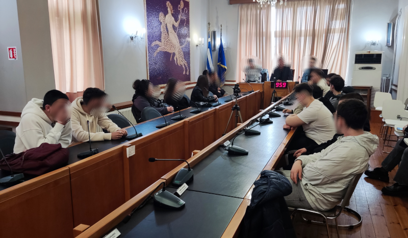
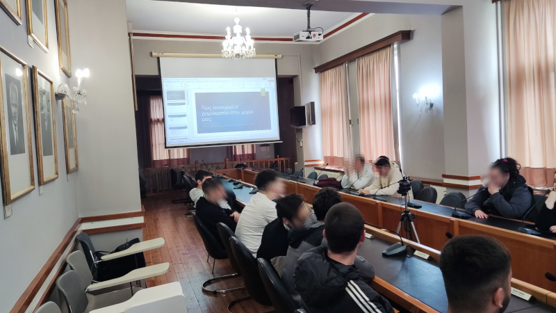
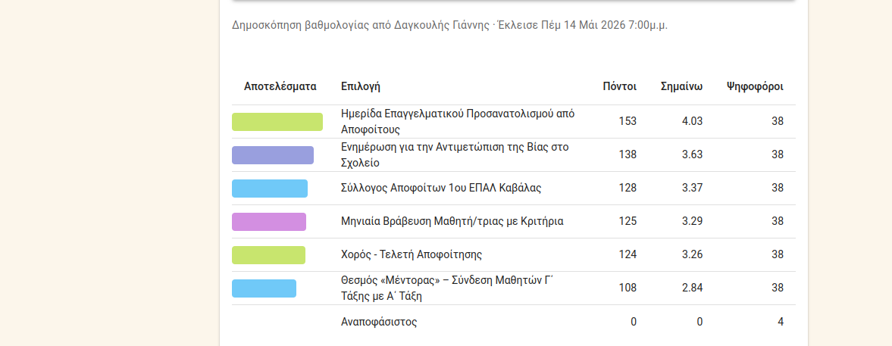

# Ανοιχτό Λογισμικό για την Άμεση Δημοκρατία στο Σχολείο και την Τοπική Κοινότητα

**8ος Πανελλήνιος Διαγωνισμός Ανοιχτών Τεχνολογιών στην Εκπαίδευση**  
**1ο ΕΠΑ.Λ. Καβάλας** – Γ΄ τάξη  
*Υπεύθυνος εκπαιδευτικός: Ιωάννης Δαγκουλής*  
*Περίοδος υλοποίησης: Ιανουάριος – Μάιος 2026*

---

## Σύνοψη

Στο πλαίσιο του μαθήματος «Σχεδιασμός και Ανάπτυξη Διαδικτυακών Εφαρμογών», η μαθητική μας ομάδα μελέτησε, αξιολόγησε και εφάρμοσε πιλοτικά ανοιχτό λογισμικό (ΕΛ/ΛΑΚ) για την υποστήριξη της συμμετοχικής δημοκρατίας. Στόχος ήταν να διερευνηθεί πώς εργαλεία όπως τα **Loomio** και **Decidim** μπορούν να αξιοποιηθούν στο σχολείο και την τοπική κοινότητα.

Το έργο συνδύασε **θεωρητική μελέτη** (έννοιες άμεσης δημοκρατίας, διεθνή παραδείγματα), **επίσκεψη πεδίου** (Δημαρχείο Καβάλας) και **πιλοτική εφαρμογή** ψηφιακών εργαλείων (Loomio, ZEUS, e-me).

---

## Θεωρητικό πλαίσιο – Τι είναι η Άμεση Δημοκρατία

### Ορισμός

**Άμεση δημοκρατία** (ή συμμετοχική δημοκρατία) είναι το πολίτευμα στο οποίο οι πολίτες αποφασίζουν απευθείας για τους νόμους και τις πολιτικές, χωρίς ενδιάμεσους εκπροσώπους. Αντίθετα, στην **αντιπροσωπευτική δημοκρατία** οι πολίτες εκλέγουν αντιπροσώπους που αποφασίζουν για λογαριασμό τους.

### Ιστορικές μορφές

- **Αρχαία Αθήνα (5ος-4ος αι. π.Χ.):** Η «Εκκλησία του Δήμου» συνεδρίαζε τακτικά. Όλοι οι ελεύθεροι άνδρες πολίτες μπορούσαν να μιλήσουν, να προτείνουν νόμους και να ψηφίσουν.
- **Νεότερη Ελβετία:** Από τον 19ο αιώνα, η Ελβετία συνδυάζει αντιπροσωπευτική δημοκρατία με ισχυρούς μηχανισμούς άμεσης συμμετοχής (δημοψηφίσματα, λαϊκές πρωτοβουλίες).

### Πλεονεκτήματα & Μειονεκτήματα

| Πλεονεκτήματα | Μειονεκτήματα/Προκλήσεις |
| :--- | :--- |
| Νομιμοποίηση αποφάσεων | Απαιτείται χρόνος και γνώση από τους πολίτες |
| Ενεργή πολιτική παιδεία | Κίνδυνος συναισθηματισμού και προπαγάνδας |
| Έλεγχος εξουσίας – μείωση διαφθοράς | Ανάγκη προστασίας μειοψηφιών |

### Η ψηφιακή διάσταση

Η τεχνολογία μπορεί να μειώσει το πρόβλημα του «χρόνου & γνώσης» μέσω:
- **Ασύγχρονης συμμετοχής** (κινητό, υπολογιστής)
- **Κλιμάκωσης** (εκατοντάδες χιλιάδες πολίτες ταυτόχρονα)
- **Διαφάνειας** (ελέγξιμος κώδικας ανοιχτού λογισμικού)

---
## Εκπαιδευτικοί Στόχοι

Το έργο σχεδιάστηκε για να επιτύχει τους εξής παιδαγωγικούς σκοπούς:

1. **Κατανόηση του θεωρητικού πλαισίου** της άμεσης δημοκρατίας και διάκριση από την αντιπροσωπευτική.
2. **Βιωματική επαφή** με τον χώρο λήψης αποφάσεων (Δημαρχείο, αίθουσα Συμβουλίου).
3. **Εγκατάσταση και διαχείριση** πλατφόρμας ανοιχτού λογισμικού (Loomio με Docker, mail server).
4. **Πρακτική εξάσκηση** σε εργαλεία άμεσης δημοκρατίας (ψηφοφορία, διαβούλευση).
5. **Ανάπτυξη δεξιοτήτων συνεργασίας** και ψηφιακού γραμματισμού (e-me, ZEUS).
6. **Τεκμηρίωση και διάχυση** του έργου (GitHub, GitHub Pages, ανοιχτές άδειες).

> **Άδειες χρήσης:** Το λογισμικό που χρησιμοποιήθηκε είναι FOSS (GNU AGPLv3 για Loomio). Το παραγόμενο υλικό διατίθεται με άδεια **Creative Commons Attribution-ShareAlike 4.0 (CC BY-SA 4.0)**.

---

## Παιδαγωγική Αξία & Δεξιότητες που Αναπτύχθηκαν

Το έργο είχε παιδαγωγική αξία τόσο κατά τη διάρκεια της υλοποίησής του, όσο και στα τελικά του αποτελέσματα.

### Κατά την εκτέλεση (διαδικασία)

| Δεξιότητα / Δραστηριότητα | Πώς εφαρμόστηκε |
| :--- | :--- |
| **Ομαδοσυνεργατική εργασία** | Χωρισμός σε 4 ομάδες για μελέτη διαφορετικών θεματικών ενοτήτων (μέσω e-me) |
| **Επικοινωνία & παρουσίαση** | Παρουσίαση των συμπερασμάτων κάθε ομάδας στην τάξη |
| **Διερεύνηση & ανάλυση** | Αναζήτηση διεθνών παραδειγμάτων (Ελβετία, Βαρκελώνη), μελέτη θεσμικού πλαισίου Δήμου |
| **Κριτική σκέψη** | Αντιπαραβολή υπάρχουσας διαδικασίας ενημέρωσης (group ανά τάξη) με τη χρήση Loomio |
| **Επικοινωνία με φορείς** | Προετοιμασία για επίσκεψη στο Δημαρχείο, διατύπωση ερωτήσεων |

### Στα αποτελέσματα (γνώσεις & στάσεις)

- **Κατανόηση βασικών αρχών πολιτικής παιδείας:** Διάκριση άμεσης / αντιπροσωπευτικής δημοκρατίας, λειτουργία τοπικών θεσμών.
- **Επαφή με την κοινωνία και τις λειτουργίες της:** Η επίσκεψη στο Δημαρχείο και η συζήτηση στην αίθουσα του Δημοτικού Συμβουλίου έδωσε βιωματική κατανόηση της λήψης αποφάσεων. Η επαφή με το Δημοτικό Συμβούλιο Νεολαίας ανέδειξε δυνατότητες και αδυναμίες (ατονία) των θεσμών συμμετοχής.
- **Αίσθημα ευθύνης και ενεργού πολίτη:** Οι μαθητές διαπίστωσαν ότι η συμμετοχή απαιτεί κίνητρα, διαφάνεια και κατάλληλα εργαλεία.

### Τεχνικές & ψηφιακές δεξιότητες

| Δεξιότητα | Πώς αποκτήθηκε |
| :--- | :--- |
| **Εγκατάσταση & παραμετροποίηση διαδικτυακής εφαρμογής** | Loomio σε server (Docker, ρύθμιση περιβάλλοντος, SSL, mail server) |
| **Μελέτη, ανάλυση και αξιολόγηση λογισμικού** | Σύγκριση 4 πλατφορμών (Loomio, Decidim, LiquidFeedback, Polis) βάσει κριτηρίων (κόστος, ευχρηστία, ανοιχτός κώδικας) |
| **Διαχείριση χρηστών & πειραματική εφαρμογή** | Δημιουργία λογαριασμών μέσω κρυφού link εγγραφής, παρακολούθηση ψηφοφορίας |
| **Τεκμηρίωση & διάχυση** | Χρήση GitHub (README, GitHub Pages, εικόνες) |

---

## Παραδοτέα

| # | Παραδοτέο | Κατάσταση |
| :--- | :--- | :--- |
| 1 | Έκθεση σύγκρισης ανοιχτών πλατφορμών (Loomio, Decidim, LiquidFeedback, Polis) | ✅ |
| 2 | Σενάριο χρήσης σε σχολικό περιβάλλον | ✅ |
| 3 | Πιλοτική εφαρμογή ψηφοφορίας/διαβούλευσης με Loomio | ✅ |
| 4 | Παρουσίαση αποτελεσμάτων και συμπερασμάτων | ✅ |
| 5 | Τεκμηρίωση ανοιχτού κώδικα & οδηγίες εγκατάστασης | ✅ |

---
## Επίσκεψη στο Δημαρχείο Καβάλας (30/04/2026)

Στα πλαίσια του έργου πραγματοποιήθηκε εκπαιδευτική επίσκεψη στο Δημαρχείο Καβάλας, όπου οι μαθητές είχαν την ευκαιρία να συζητήσουν με στελέχη του Δήμου.

### Συνάντηση με τον Αντιδήμαρχο

Μας υποδέχθηκε ο **κ. Χριστόδουλος Μιχαλάκης**, Αντιδήμαρχος Παιδείας και Προσχολικής Αγωγής, στην **αίθουσα του Δημοτικού Συμβουλίου**. Περιέγραψε τον τρόπο λήψης αποφάσεων σε τοπικό επίπεδο και τόνισε ότι ο Δήμος επιδιώκει την ενεργή συμμετοχή των πολιτών, ειδικά των νέων.

### Το έργο «Kavala Urban Center»

Η **κ. Θάλεια Χωρινού**, προϊσταμένη του Τμήματος Προγραμματισμού και Επιχειρησιακού Σχεδιασμού, μας ενημέρωσε για τη δράση **«Kavala Urban Center – Σχέδιο Πόλις»**. Στόχος είναι η δημιουργία κουλτούρας «συναποφασίζειν». Ο Δήμος μελετά τη χρήση ανοιχτών εργαλείων όπως **Loomio** και **Decidim** (μηδενικό κόστος, δυνατότητα προσαρμογής).

### Το Δημοτικό Συμβούλιο Νεολαίας

Ο **κ. Ιωάννης Μιχαηλίδης**, πρόεδρος του Δημοτικού Συμβουλίου Νεολαίας Καβάλας, περιέγραψε τον θεσμό (νέοι 17-35 ετών, συμβουλευτικός χαρακτήρας). **Δυστυχώς, ο θεσμός έχει ατονήσει** λόγω του μη δεσμευτικού χαρακτήρα του θεσμού.

### Η συζήτηση και τα συμπεράσματα

Οι μαθητές συζήτησαν το θέμα της έλλειψης συμμετοχής. **Η σημαντικότερη συμφωνία:** Προτάθηκε από τον Δήμο και έγινε αποδεκτή από το σχολείο η **πειραματική χρήση του Loomio** για την επανεκκίνηση του θεσμού.

> *Παιδαγωγική αξία:* Οι μαθητές συνομίλησαν ως ίσοι με τους ιθύνοντες της πόλης – η δημοκρατία δεν είναι μόνο θεωρία, αλλά πράξη σε συγκεκριμένους χώρους.

---

# Ψηφιακά εργαλεία που αξιοποιήθηκαν

| Εργαλείο | Σκοπός | Αποτέλεσμα |
| :--- | :--- | :--- |
| **Loomio** | Συνεργατική λήψη αποφάσεων, διαβούλευση | Πιλοτική εφαρμογή (βλ. παρακάτω) |
| **ZEUS (GRNET)** | Ηλεκτρονική ψηφοφορία με ακεραιότητα | Δοκιμαστική ψηφοφορία στην τάξη |
| **e-me (ΠΣΔ)** | Πλατφόρμα συνεργασίας, διαχείριση εργασιών | Καταμερισμός θεωρητικών ενοτήτων σε 4 ομάδες |

> Το **e-me** είναι προϊόν ανοιχτού κώδικα (FOSS) – μία από τις πρώτες υλοποιήσεις Personal Learning Environment παγκοσμίως για σχολική εκπαίδευση.
---

## Οργάνωση εργασιών – Ομάδες μαθητών στο e-me

Για τη θεωρητική προετοιμασία, οι μαθητές χωρίστηκαν σε **4 ομάδες**. Η οργάνωση έγινε μέσω e-me.

| Ομάδα | Θέμα | Παραδοτέο |
| :--- | :--- | :--- |
| 1 | Θεωρητικό πλαίσιο – Άμεση Δημοκρατία | Κείμενο + παρουσίαση |
| 2 | Ηλεκτρονική Διακυβέρνηση – Ψηφοφορίες | Παρουσίαση + μελέτη ZEUS |
| 3 | Διαβούλευση & Συλλογικές Αποφάσεις | Παρουσίαση + δοκιμή σεναρίου |
| 4 | Συμμετοχική Δημοκρατία & Τοπική Κοινότητα | Κείμενο + προτάσεις για Δήμο |

---

## Πιλοτική εφαρμογή – Loomio

### Εγκατάσταση

Το Loomio εγκαταστάθηκε σε αυτο-φιλοξενούμενη έκδοση:  
🔗 [https://loomio.kvln.online](https://loomio.kvln.online)

### Διαδικασία συμμετοχής

Δημιουργήθηκε **κρυφό link εγγραφής** από το Loomio, το οποίο κοινοποιήθηκε μέσω της ιστοσελίδας του σχολείου για περιορισμένο χρονικό διάστημα. Οι μαθητές εγγράφηκαν μόνοι τους χρησιμοποιώντας τα προσωπικά τους email.

### Σενάριο ψηφοφορίας

Ζητήθηκε από τους μαθητές να αξιολογήσουν **6 προτάσεις βελτίωσης του σχολείου** με score poll (1-5).

| Πρόταση | Πόντοι | Μ.Ο. |
| :--- | :--- | :--- |
| Ημερίδα Επαγγελματικού Προσανατολισμού | 153 | 4.03 |
| Ενημέρωση για Βία στο Σχολείο | 138 | 3.63 |
| Σύλλογος Αποφοίτων | 128 | 3.37 |
| Μηνιαία Βράβευση Μαθητή | 125 | 3.29 |
| Χορός – Τελετή Αποφοίτησης | 124 | 3.26 |
| Θεσμός «Μέντορας» | 108 | 2.84 |

**Συμμετοχή:** 38 μαθητές (από τους 345 του σχολείου) – λόγω πειραματικής φάσης στο τέλος της χρονιάς.

### Λειτουργία από κινητό

Δοκιμάστηκε από κινητά τηλέφωνα. Η εμπειρία ήταν πλήρως λειτουργική.

### Αντίδραση μαθητών

- Το Loomio έγινε άμεσα κατανοητό από το **15μελές Μαθητικό Συμβούλιο**.
- Κρίθηκε **ταχύτερο και διαφανέστερο** από την υπάρχουσα διαδικασία ενημέρωσης ανά τάξη.
- Το 15μελές ζήτησε να χρησιμοποιηθεί το εργαλείο από την επόμενη σχολική χρονιά.

### Επέκταση

- Ο Διευθυντής του σχολείου ενδιαφέρθηκε για χρήση του Loomio από τον **Σύλλογο Διδασκόντων**.
- Βρισκόμαστε σε συζητήσεις με την **ΕΛΜΕ Καβάλας** για πιλοτική χρήση.

---

## Πρόταση για τον Δήμο Καβάλας: Decidim

Το **Decidim** είναι πλατφόρμα συμμετοχικής δημοκρατίας ανοιχτού κώδικα, που χρησιμοποιείται από **400+ πόλεις** παγκοσμίως (π.χ. Βαρκελώνη). Η μελέτη μας έδειξε ότι η ενσωμάτωσή του στον Δήμο Καβάλας θα απαιτούσε **σημαντική προσπάθεια και αναδιοργάνωση υπηρεσιών**, γι' αυτό δεν προβλέπεται στο άμεσο μέλλον.

Αντ' αυτού, προτάθηκε **πειραματική χρήση του Loomio** για το Δημοτικό Συμβούλιο Νεολαίας, σε συνεργασία με το σχολείο.

---

## Συμπεράσματα

1. **Η τεχνολογία λειτουργεί** – το Loomio εγκαταστάθηκε και χρησιμοποιήθηκε με επιτυχία.
2. **Η συμμετοχή χρειάζεται σχεδιασμό** – η πειραματική φάση στο τέλος της χρονιάς είχε περιορισμένη συμμετοχή (38 μαθητές), αλλά το 15μελές ζήτησε χρήση από την επόμενη χρονιά.
3. **Το εργαλείο έχει ζήτηση** – από μαθητές, Διευθυντή και ΕΛΜΕ.
4. **Ανοιχτό λογισμικό:** πλεονεκτήματα σε κόστος, διαφάνεια και ιδιοκτησία δεδομένων.

---

## Ευχαριστίες

Ευχαριστούμε τον Δήμο Καβάλας και ιδιαίτερα τον κ. Χριστόδουλο Μιχαλάκη, την κ. Θάλεια Χωρινού και τον κ. Ιωάννη Μιχαηλίδη για την υποδοχή και τη συνεργασία.

---

## Σύνδεσμοι

- 🔗 [GitHub repository](https://github.com/1epalKavala/directDemocracy)
- 🔗 [GitHub Pages (site έργου)](https://1epalKavala.github.io/directDemocracy)
- 🔗 [Ιστολόγιο e-me (αρχική παρουσίαση)](https://blogs.e-me.edu.gr/hive-a-l-a-d-t-k345cdfgdfg/?lang=el)
- 🔗 [Loomio πιλοτική εγκατάσταση](https://loomio.kvln.online)
- 🔗 [ZEUS – GRNET](https://grnet.gr/services/digital-services/zeus/)
- 🔗 [Decidim](https://decidim.org/)

---

*Το έργο υλοποιήθηκε με χρήση αποκλειστικά ανοιχτού λογισμικού (FOSS) και είναι διαθέσιμο προς αξιοποίηση.*
